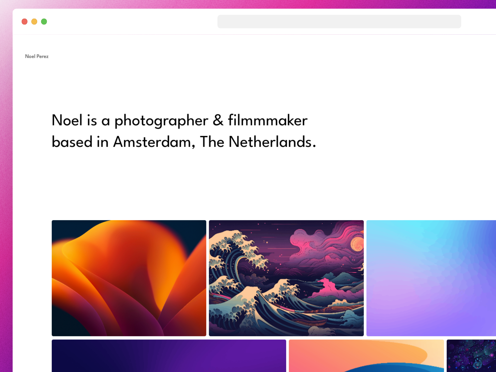

<div align="center">



</div>

## ⚙️ Stack

- [**Astro** + **Typescript**](https://astro.build/) - Astro is the all-in-one web framework designed for speed.
- [**Tailwind CSS**](https://tailwindcss.com/) - Tailwind CSS is a utility-first CSS framework.

## ✏️ Prerequisites

- [Nodejs +16 (LTS recommended)](https://nodejs.org/en/)

## 🚀 Getting Started

**Recommended extensions for VSCode:**

- [Tailwind CSS IntelliSense](https://marketplace.visualstudio.com/items?itemName=bradlc.vscode-tailwindcss).
- [Astro](https://marketplace.visualstudio.com/items?itemName=astro-build.astro-vscode).

1. Clone or [fork](https://github.com/kimooamigo/GalleryPhoto-Website/fork) the repository:

```bash
git@github.com:kimooamigo/GalleryPhoto-Website.git
```

2. Select Directory Path 

```bash
cd GalleryPhoto-Website
```

3. Install dependencies:

```bash
npm install
# or
yarn install
# or
pnpm install
```

4. Run the development server:

```bash
npm run dev
# or
yarn dev
# or
pnpm dev
```

## ☁ Deploys

- [Vercel](https://vercel.com/)

